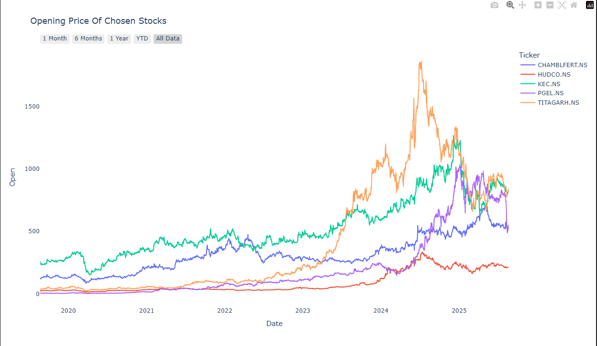
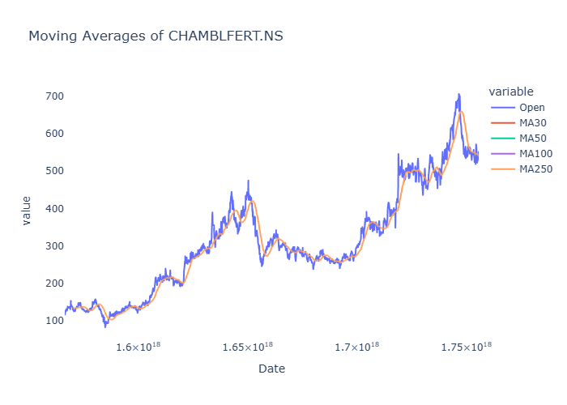
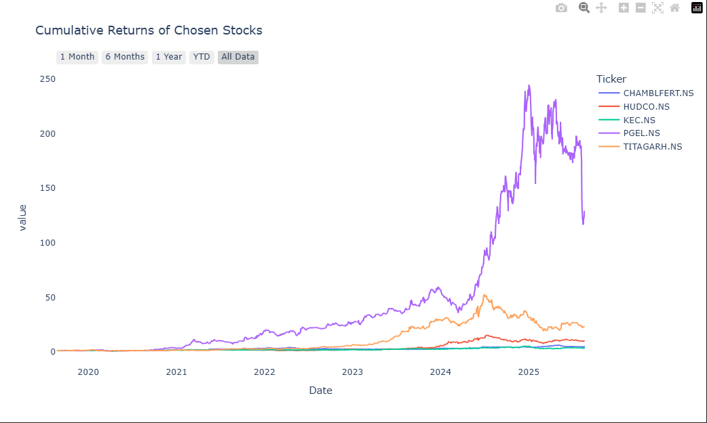
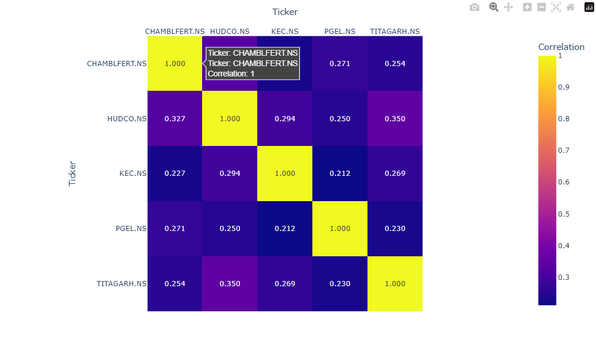

# 📈 Stock Market Analysis (NSE) using Pandas & Plotly

This project analyzes **5 selected stocks from the NSE (National Stock Exchange of India)** and performs detailed studies on their **price trends, volatility, and cumulative returns**.  

The goal of this project is to **showcase my familiarity with Pandas and Plotly** — two powerful Python libraries for **data manipulation** and **interactive visualization**.  

---

## 🚀 Project Overview  

Using **Pandas**, I:  
✔️ Cleaned and pre-processed raw stock price CSV files  
✔️ Extracted useful insights (returns, volatility, trends)  
✔️ Prepared the data for visualization  

Using **Plotly**, I:  
✔️ Built **interactive stock price charts**  

 

✔️ Visualized **Moving Averages**

 

✔️ Compared **cumulative returns** of the chosen stocks 

 

✔️ Compared **collinearity** of the chosen stocks 

  

---

## 📂 Repository Structure  

```bash
Stock-Market-Analysis/  
│── html/  
│   └── project.html              # Full interactive notebook (download & open in browser)
|__ india_stocks_6years.csv       # Cleaned data of about 6 years of 5 stocks(2019-2025)
│  
│── images/  
│   ├── opening_prices.png          # Stock price trend chart  
│   ├── traded_value.png            # Volatility analysis chart  
│   └── cumulative_returns.png    # Cumulative returns visualization  
│  
│── technical_code.ipynb          # Jupyter Notebook with Pandas & Plotly code  
│── README.md                     # Project documentation (this file)  

```

---

## 🔍 Key Analysis  

📊 **Trends in Stock Prices** – Daily price changes across selected NSE stocks  
📉 **Volatility of Returns** – Measuring the ups and downs in daily returns  
📈 **Cumulative Returns** – Long-term performance comparison across stocks  

---

## 📌 How to Explore the Project  

👉 **1. Quick Look**  
- Open the `images/` folder for static snapshots of the charts.  

👉 **2. Full Interactivity (Recommended)**  
- GitHub does **not support interactive Plotly charts directly**.  
- To explore full interactivity:  
  1. Download the file: [`html/project.html`](./html/project.html)  
  2. Open it in your browser  
  3. You’ll be able to **zoom, hover, and interact** with the charts 🎉  

👉 **3. Technical Code**  
- Check `technical_code.ipynb` for the full Jupyter Notebook code (data cleaning + analysis + charts).  

---

## 🛠️ Technologies Used  

- 🐍 **Python**  
- 🗂️ **Pandas** – Data cleaning, manipulation, returns calculation  
- 📊 **Plotly** – Interactive charting and visualization  
- 📓 **Jupyter Notebook** – Analysis environment  


---

## ⚡ Getting Started (Optional: Run the Notebook Yourself)  

If you want to re-run the analysis:  

```bash
# Clone the repository
git clone https://github.com/your-username/your-repo-name.git
cd your-repo-name

# Install dependencies
pip install pandas plotly jupyter

# Open Jupyter Notebook
jupyter notebook technical_code.ipynb
```
📬 Contact

If you’re a hiring manager, data enthusiast, curious learner, or you have any doubt feel free to connect:

💼 [LinkedIn](https://www.linkedin.com/in/pradumnchauhan)!

📧 [Email](pradumnchauhan2812@gmail.com)!

